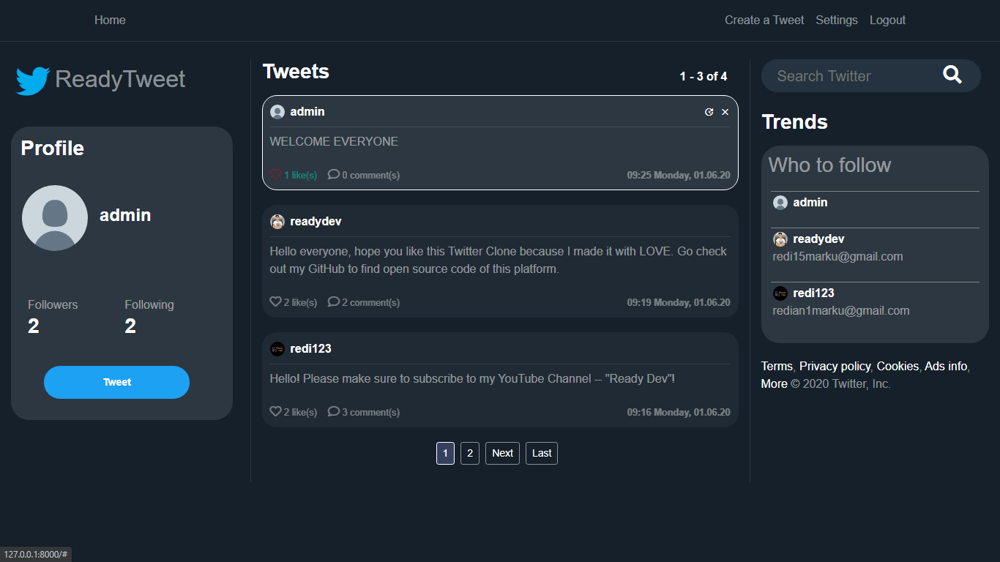

# Django Twitter Clone 

Fully functional Django App that looks ecxatly like real Twitter.

Demo Image:


## Setup

1. Git Clone the project with: ```git clone https://github.com/redianmarku/Django-Twitter-Clone.git```.

2. Move to the base directory: ```cd Django-Twitter-Clone```

3. Create a new python enveronment with: ```python -m venv env```.

4. Activate enveronment with: ```env\Scripts\activate``` on windows, or ```source env/bin/activate``` on Mac and Linux.

5. Install required dependences with: ```pip install -r requirements.txt```.

6. Make migrations with: ```python manage.py makemigrations``` and then ```python manage.py migrate```.

7. Run app localy with: ```python manage.py runserver```.


Personal task list: 

-change Newsment logo to original one

-adjust time so it's am and pm, not just 24-hour intervals

-privacy, cookies, etc. 

-awards!!

-search comments as well

-Add notifications and @s for respondng comments and mentioning

-personal messagin as well? 

-when linking a post, link the whole thing, while also linking the artice itself separately so users aren't confused (article link and link of post)

-dark and light mode? 

-error when user adds extra words, not just a link
